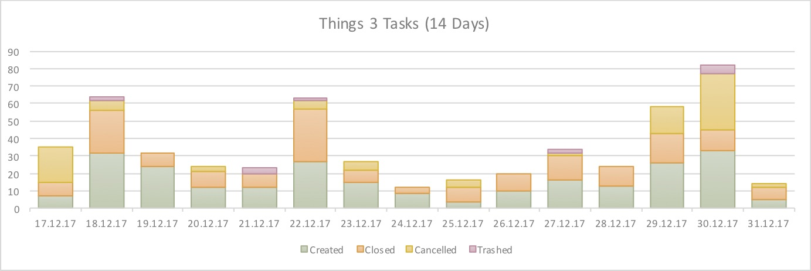
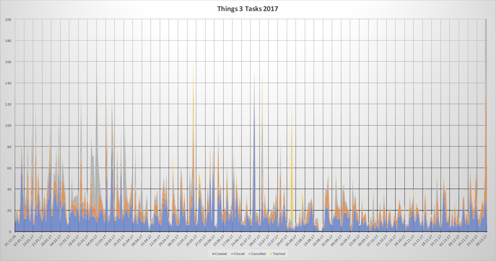
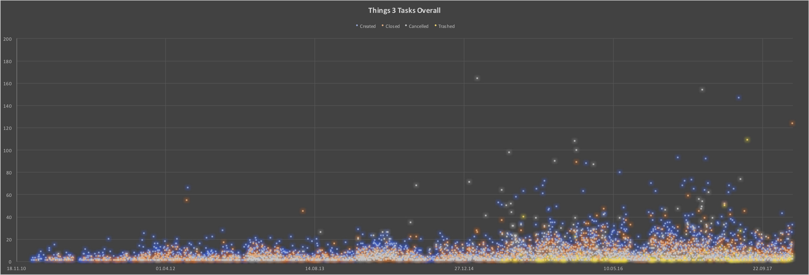

# Things 3 CLI

## Overview

Simple read-only comand-line interface to your Things 3 database (incl. CSV export). Since Things uses a SQLite database (which should come pre-installed on your Mac) we can simply query it straight from the command line. We only do read operations since we don't want to mess up your data.

[](https://travis-ci.org/AlexanderWillner/things.sh)

## Installation

You can use [brew](https://brew.sh) to install and later update the script:

 - Prepare: ```brew tap AlexanderWillner/tap```
 - Install: ```brew install things.sh```
 - Upgrade: ```brew upgrade```
 - Autocompletion: ```brew install bash-completion```. Then add to ```~/.bashrc```:

```
    if [ -f $(brew --prefix)/etc/bash_completion ]; then
      . $(brew --prefix)/etc/bash_completion
    fi
```
 
## Example Graphs

These graphs have been generated based on the CSV export. For example: ```things.sh -r '-14 days' statcsv > lastTwoWeeks.csv && open lastTwoWeeks.csv``` (and then generating a ```Stacked Column``` graph).







## Instructions

Note that you could override the location of the database used by setting the THINGSDB environment variable. For usage information, run the script with no arguments or with "help":

```
$ things.sh --limitBy 5 help
usage: things.sh <OPTIONS> [COMMAND]

OPTIONS:
  -l|--limitBy <number>    Limit output by <number> of results
  -w|--waitingTag <tag>    Set waiting tag to <tag>
  -o|--orderBy <column>    Sort output by <column> (e.g. 'userModificationDate' or 'creationDate')
  -s|--string <string>     String <string> to search for
  -r|--range <string>      Limit CSV statistic export by <string>
  
COMMANDS:
  inbox                    Shows 5 inbox tasks ordered by creationDate
  today                    Shows 5 todays tasks ordered by index
  upcoming                 Shows 5 upcoming tasks ordered by date
  next                     Shows 5 next tasks ordered by creationDate
  someday                  Shows 5 someday tasks ordered by creationDate
  completed                Shows 5 completed tasks ordered by creationDate
  cancelled                Shows 5 cancelled tasks ordered by cancel date
  trashed                  Shows 5 trashed tasks ordered by creationDate
  feedback                 Opens the feedback web page to request and propose changes
  all                      Shows 5 tasks ordered by creationDate
  csv                      Exports all tasks as semicolon seperated values incl. notes and Excel friendly
  due                      Shows 5 tasks ordered by due date
  headings                 Shows 5 headings ordered by creationDate
  mostClosed               Shows 5 days on which most tasks were closed
  mostCancelled            Shows 5 days on which most tasks were cancelled
  mostTrashed              Shows 5 days on which most tasks were trashed
  mostCreated              Shows 5 days on which most tasks were created
  mostTasks                Shows 5 projects that have most tasks
  mostCharacters           Shows 5 tasks that have most characters
  nextish                  Shows 5 nextish tasks ordered by creationDate
  old                      Shows 5 old tasks ordered by creationDate
  projects                 Shows 5 projects ordered by creationDate
  repeating                Shows 5 repeating tasks ordered by creationDate
  search                   Searches for a specific task
  stat                     Provides a number of statistics about all tasks
  statcsv                  Exports some statistics as semicolon separated values for -1 year
  subtasks                 Shows 5 subtasks ordered by creationDate
  waiting                  Shows 5 tasks with the tag Waiting
```

## Examples 

### CSV export and open with Excel

```things.sh csv > Things3Export.csv && open Things3Export.csv```

### Statistics

```
$ things.sh stat
Inbox     : 0
Today     : 7
Upcoming  : 156
Next      : 15
Someday   : 822

Completed : 11976
Cancelled : 9250
Trashed   : 545

Tasks     : 968
Subtasks  : 56
Waiting   : 111
Projects  : 89
Repeating : 89
Nextish   : 146
Headings  : 53

Oldest    : 2010-09-28|XXX|XXX
Farest    : 2021-01-04|XXX|XXX
Longest   : 167|XXXXXXXXXXXXXX
Largest   : 128|XXXXXXXXXXXXXX

Created   : 147|2017-07-04
Closed    : 124|2017-12-30
Cancelled : 324|2017-12-30
Trashed   : 109|2017-08-02
Days/Task : 41.0
```

### Create Scheduled Event

In case you have regularly to create projects based on a template (e.g., a business trip or family vacation), this can be automated using the following command:

```
things.sh --start 2018-03-20 --days 7 --event resources/exampleEvent.thingslist schedule
```

## Other Information

### Things URL Helper

[](https://youtu.be/6niSmdXanug)

The application ```ThingsURLHelper.app``` in the folder ```resources``` opens URLs of the form ```thingstodo://show?uuid=XXX``` with XXX being the ```UUID``` of a todo.
By using ```things.sh csv``` you can identify the according URL of each task and open it within any macOS application, such as spotlight. Above an example using a local web page. Please note that this has been depreciated since Things 3.4.

### Markdown Clipboard to Things Workflow

[](https://youtu.be/HTaxOkZb9S4)

You can use the [macOS](https://support.apple.com/kb/PH25241) and [Alfred](https://www.alfredapp.com/blog/tips-and-tricks/tutorial-importing-and-setting-up-alfred-workflows/) workflows in the folder ```resources``` to automatically convert MarkDown todos into Things3 tasks. Above an example using Bear.app.

## CREDITS
 * Author        : Arjan van der Gaag (script for Things 2)
 * Author        : Alexander Willner (updates for Things 3, complete rewrite)
 * License       : Whatever. Use at your own risk.
 * Source        : https://github.com/AlexanderWillner/things.sh
 * Shell checker : https://github.com/koalaman/shellcheck
 * Shell cleanup : https://github.com/mvdan/sh/
 * Shell tips    : https://dev.to/thiht/shell-scripts-matter
 * Shell tips    : https://google.github.io/styleguide/shell.xml
 * Shell tips    : https://kvz.io/blog/2013/11/21/bash-best-practices/
 * Shell tips.   : https://github.com/progrium/bashstyle
 
